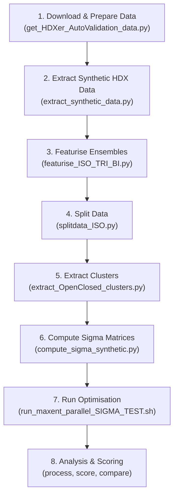

# Example 1: IsoValidation with Open-Mass (TeaA Membrane Transporter)

## Overview

The **IsoValidation** (Isolated Validation) experiment is a self-consistent, model-agnostic benchmarking workflow that uses a **known ground truth** to evaluate the quality of ensemble reweighting methods. It is a core validation paradigm used in the JAX-ENT manuscript to demonstrate that maximum entropy (MaxEnt) reweighting can reliably recover conformational populations from Hydrogen Deuterium Exchange Mass Spectrometry (HDX-MS) data.

### Biological System

This example uses the **TeaA membrane transporter**, a protein with two major conformational states:
- **Open** conformation
- **Closed** conformation

The target ground truth population ratio is **Open : Closed = 40% : 60%** (inverted from a natural distribution to make the validation challenging).

### Scientific Motivation

A fundamental challenge in ensemble modelling is knowing whether a model's fitted parameters (e.g. frame weights) actually correspond to the real conformational populations. IsoValidation solves this by:

1. **Starting from known structure**: Taking an MD trajectory with identifiable conformational states.
2. **Creating synthetic data**: Computing artificial HDX uptake curves from these states at a known population ratio.
3. **Inverting the populations**: Using a ratio that is plausible but *unnatural*, so recovery requires genuine model fitting (not just recognising a default equilibrium).
4. **Measuring recovery**: After fitting, comparing recovered populations against the known ground truth using the Jensen-Shannon Divergence.

---

## Essential Workflow



---

## Prerequisites

### Installation

```bash
cd /path/to/installdir/
git clone https://github.com/alexisiddiqui/JAX-ENT.git
cd JAX-ENT/
uv venv
source .venv/bin/activate
uv pip install -e .
```

### Data Requirements

The data comes from the Bradshaw et al. reproducibility pack hosted on Zenodo:
- **Zenodo**: https://zenodo.org/records/3629554 (~13 GB full archive)
- **Google Drive (trimmed)**: https://drive.google.com/drive/folders/1Y9294af-SLca80Xk4D2gmg460NXlt7wX?usp=sharing (~275 MB `_Bradshaw` folder)

Place the `_Bradshaw` directory inside `data/`.

> [!IMPORTANT]
> All scripts use **relative paths** calculated from `os.path.dirname(__file__)`. You should run all commands from the **JAX-ENT root directory**.

---

## Directory Structure

```
1_IsoValidation_OMass/
├── README.md                              # This file
├── INSTRUCTIONS.md                        # Quick-start instructions
├── commands.sh                            # Master command sequence
│
├── data/                                  # Data preparation & downloads
│   ├── _Bradshaw/                         # Downloaded Bradshaw reproducibility pack
│   ├── _output/                           # Extracted synthetic data files
│   ├── _clustering_results/               # RMSD-based cluster assignments
│   ├── download_data.sh                   # Google Drive download script
│   ├── get_HDXer_AutoValidation_data.py   # Download + slice + filter trajectories
│   ├── extract_synthetic_data.py          # Extract dfrac/segs + intrinsic rates
│   ├── extract_OpenClosed_clusters.py     # RMSD clustering for validation
│   └── jaxENT_prepare_TeaA_data.py        # PCA analysis & trajectory preparation
│
├── fitting/jaxENT/                        # Featurisation, splitting, & optimisation
│   ├── _featurise/                        # BV model features (.npz) & topologies (.json)
│   ├── _datasplits/                       # Train/val splits by strategy
│   ├── _covariance_matrices_sigma/        # Computed Sigma (covariance) matrices
│   ├── _optimise*/                        # Optimisation output directories
│   ├── featurise_ISO_TRI_BI.py            # BV featurisation of ensembles
│   ├── splitdata_ISO.py                   # Data splitting (5 strategies × 3 replicates)
│   ├── compute_sigma_synthetic.py         # Cluster-weighted covariance matrices
│   ├── optimise_ISO_TRI_BI_splits_Sigma.py # Serial optimisation sweep
│   ├── optimise_fn.py                     # Optimisation helper functions
│   ├── run_maxent_parallel_SIGMA_TEST.sh  # Parallel optimisation + full analysis pipeline
│   └── run_maxent_parallel.sh             # Alternative parallel runner
│
├── analysis/                              # Post-optimisation analysis
│   ├── plot_intrinsic_rates_simple.py     # Compare HDXer vs jaxENT intrinsic rates
│   ├── analyse_split_ISO_TRI_BI.py        # Visualise data splits (heatmaps, gaps)
│   ├── process_optimisation_results.py    # Extract predictions from HDF5 results
│   ├── score_models_ISO_TRI_BI.py         # Compute MSE, dMSE, work metrics, recovery %
│   ├── analyse_scores_mixed_linear_model.py # Statistical model selection analysis
│   ├── plot_selected_models_ISO_TRI_BI.py # Plot selected model results
│   ├── plot_compare_jaxENT_HDXer.py       # Publication-ready HDXer vs jaxENT comparison
│   ├── recovery_analysis_ISO_TRI_BI_precluster.py  # Conformational recovery analysis
│   ├── weights_validation_ISO_TRI_BI_precluster.py # Frame weight validation
│   ├── CV_validation_ISO_TRI_BI_precluster.py      # Cross-validation analysis
│   └── analyse_loss_ISO_TRI_BI.py         # Loss landscape analysis
│
└── archive/                               # Archived/deprecated scripts
```

---

## Step-by-Step Workflow

### Step 1: Download and Prepare Validation Data

**Script**: [`get_HDXer_AutoValidation_data.py`](data/get_HDXer_AutoValidation_data.py)

```bash
python jaxent/examples/1_IsoValidation_OMass/data/get_HDXer_AutoValidation_data.py
```

This script:
- Downloads the Bradshaw et al. reproducibility pack from Zenodo (~13 GB) if `_Bradshaw/` is not already present.
- **Slices trajectories** to every Nth frame (default: every 20th) using MDAnalysis, producing:
  - `TeaA_closed_sliced.xtc`
  - `TeaA_open_sliced.xtc`
  - `TeaA_initial_sliced.xtc` (combined trajectory)
- **Creates a filtered (bi-modal) trajectory** (`TeaA_filtered_sliced.xtc`) by:
  - Computing Cα RMSD to both open and closed reference structures.
  - Retaining only frames with RMSD ≤ 1.0 Å to either reference.
  - Generating RMSD assignment plots and paired distance scatter plots.

**Key parameter**: `--interval N` controls slicing granularity (default: 20).

**Output**: Sliced trajectories in `data/_Bradshaw/.../sliced_<interval>/`

---

### Step 2: Extract Synthetic HDX Data

**Script**: [`extract_synthetic_data.py`](data/extract_synthetic_data.py)

```bash
python jaxent/examples/1_IsoValidation_OMass/data/extract_synthetic_data.py
```

This script:
- Reads the artificial HDX uptake data (`mixed_60-40_artificial_expt_resfracs.dat`) from the Bradshaw pack.
  - This data simulates a 60:40 Open:Closed population ratio.
- Extracts and writes:
  - **Deuterium fraction file** (`_output/..._dfrac.dat`) with timepoints: 0.167, 1.0, 10.0, 60.0, 120.0 min.
  - **Segments file** (`_output/..._segs.txt`) with peptide start/end residue indices.
- Writes the **HDXer intrinsic rates** (`out__train_TeaA_auto_VAL_1Intrinsic_rates.dat`) for ~280 residues.

> [!NOTE]
> The synthetic HDX uptake curves were originally computed using the **Persson-Halle model** with switch-function contacts, as described in the Bradshaw tutorial. This is intentionally different from the BV model used for fitting, creating a deliberate model mismatch to test robustness.

---

### Step 3: Featurise Ensembles

**Script**: [`featurise_ISO_TRI_BI.py`](fitting/jaxENT/featurise_ISO_TRI_BI.py)

```bash
python jaxent/examples/1_IsoValidation_OMass/fitting/jaxENT/featurise_ISO_TRI_BI.py
```

This script featurises two ensemble types using the **Best-Vendruscolo (BV) model** with hard contacts:

| Ensemble | Trajectory | Description |
|----------|-----------|-------------|
| **ISO-TriModal** (`iso_tri`) | `TeaA_initial_sliced.xtc` | Full sliced trajectory containing Open, Closed, and intermediate states |
| **ISO-BiModal** (`iso_bi`) | `TeaA_filtered_sliced.xtc` | Filtered trajectory containing only frames within 1.0 Å RMSD of Open or Closed references |

For each ensemble, the script:
1. Loads the trajectory with `MDAnalysis` via `Experiment_Builder`.
2. Runs `run_featurise()` to compute **heavy atom contacts** and **H-bond acceptor contacts** per residue per frame.
3. Replaces computed intrinsic rates with HDXer-provided intrinsic rates for consistency.
4. Saves features (`.npz`) and topology (`.json`) to `_featurise/`.

**Timepoints**: [0.167, 1.0, 10.0, 60.0, 120.0] minutes.

**Output**: `_featurise/features_iso_bi.npz`, `_featurise/features_iso_tri.npz`, and corresponding topology JSON files.

---

### Step 4: Split Data into Training/Validation Sets

**Script**: [`splitdata_ISO.py`](fitting/jaxENT/splitdata_ISO.py)

```bash
python jaxent/examples/1_IsoValidation_OMass/fitting/jaxENT/splitdata_ISO.py
```

Splits the synthetic HDX peptide data into training and validation sets (50/50 split) using **five different splitting strategies** with **three replicates** each:

| Strategy | Description |
|----------|-------------|
| `random` | Random peptide assignment |
| `sequence` | Contiguous sequence-based blocks |
| `sequence_cluster` | Non-redundant sequence clustering (25 clusters) |
| `stratified` | Stratified sampling by deuteration fraction |
| `spatial` | 3D spatial clustering using Cα atom positions |

Each split is saved as separate topology JSON and dfrac CSV files in `_datasplits/<strategy>/split_XXX/`.

> [!TIP]
> The `peptide_trim=1` parameter removes the first exchangeable residue from each peptide to account for fast back-exchange, consistent with experimental HDX-MS processing.

---

### Step 5: Extract Open/Closed Cluster Assignments

**Script**: [`extract_OpenClosed_clusters.py`](data/extract_OpenClosed_clusters.py)

```bash
python jaxent/examples/1_IsoValidation_OMass/data/extract_OpenClosed_clusters.py
```

Creates the ground truth cluster assignments needed for recovery analysis:
- Computes Cα RMSD of each frame to both the Open and Closed reference PDB structures.
- Assigns frames to clusters using a **hard RMSD cutoff of 1.0 Å**:
  - Cluster 0 = Open-like
  - Cluster 1 = Closed-like
  - Cluster -1 = Unassigned (> 1.0 Å from both references)

**Output**: CSV files in `data/_clustering_results/` containing per-frame RMSD values and cluster assignments for both ISO_TRI and ISO_BI ensembles.

---

### Step 6: Compute Sigma (Covariance) Matrices

**Script**: [`compute_sigma_synthetic.py`](fitting/jaxENT/compute_sigma_synthetic.py)

```bash
# For ISO_BI ensemble
python jaxent/examples/1_IsoValidation_OMass/fitting/jaxENT/compute_sigma_synthetic.py \
    --clustering_dir jaxent/examples/1_IsoValidation_OMass/data/_clustering_results \
    --features_dir jaxent/examples/1_IsoValidation_OMass/fitting/jaxENT/_featurise \
    --ensemble_name ISO_BI \
    --output_dir jaxent/examples/1_IsoValidation_OMass/fitting/jaxENT/_covariance_matrices_sigma

# For ISO_TRI ensemble
python jaxent/examples/1_IsoValidation_OMass/fitting/jaxENT/compute_sigma_synthetic.py \
    --clustering_dir jaxent/examples/1_IsoValidation_OMass/data/_clustering_results \
    --features_dir jaxent/examples/1_IsoValidation_OMass/fitting/jaxENT/_featurise \
    --ensemble_name ISO_TRI \
    --output_dir jaxent/examples/1_IsoValidation_OMass/fitting/jaxENT/_covariance_matrices_sigma
```

This script computes **covariance matrices** (Σ) from per-frame BV model predictions:

1. Loads cluster assignments and computes cluster-based frame weights to achieve target ratios (Open: 40%, Closed: 60%).
2. Runs BV forward predictions for all frames using `run_predict()`.
3. Computes the **unweighted** and **cluster-weighted covariance matrices** across residues, averaged over timepoints.
4. Computes the **inverse covariance matrix** (precision matrix) for use as Σ⁻¹ in the Sigma-MSE loss function.
5. Generates diagnostic heatmaps (standard and log-scale) and diagonal bar plots.

**Output**: `.npz` files containing Σ, Σ⁻¹, and frame weights in `_covariance_matrices_sigma/`.

---

### Step 7: Run Optimisation (MaxEnt Reweighting)

**Script**: [`run_maxent_parallel_SIGMA_TEST.sh`](fitting/jaxENT/run_maxent_parallel_SIGMA_TEST.sh)

```bash
bash jaxent/examples/1_IsoValidation_OMass/fitting/jaxENT/run_maxent_parallel_SIGMA_TEST.sh
```

This master script runs the full optimisation and analysis pipeline:

#### 7a. MaxEnt Optimisation Sweep

Calls [`optimise_ISO_TRI_BI_splits_Sigma.py`](fitting/jaxENT/optimise_ISO_TRI_BI_splits_Sigma.py) in parallel across all combinations of:

| Parameter | Values |
|-----------|--------|
| **Ensembles** | ISO_TRI, ISO_BI |
| **Loss functions** | `mcMSE` (mean-centred MSE), `MSE`, `Sigma_MSE` (covariance-weighted) |
| **Split types** | sequence_cluster, spatial (configurable) |
| **MaxEnt scaling** | 1, 5, 10, 50, 100, 1000 |
| **Convergence rates** | 1e-1 to 1e-8 (logarithmic sweep) |

Each optimisation:
1. Loads features and split data.
2. Initialises a `Simulation` with the BV forward model.
3. Optimises frame weights using `OptaxOptimizer` with MaxEnt regularisation (KL divergence from uniform prior).
4. Saves `OptimizationHistory` as HDF5 files.

**Loss functions explained**:
- **MSE**: Standard mean squared error between predicted and experimental uptake.
- **mcMSE**: Mean-centred MSE, removing global offset effects.
- **Sigma_MSE**: MSE weighted by the inverse covariance matrix (Σ⁻¹), accounting for inter-residue correlations.

**Key hyperparameters** (configurable via CLI):

| Parameter | Default | Description |
|-----------|---------|-------------|
| `--n-steps` | 500 | Optimisation steps per convergence stage |
| `--learning-rate` | 1.0 | Adam learning rate |
| `--ema-alpha` | 0.5 | Exponential moving average smoothing |
| `--forward-model-scaling` | 1000.0 | Scaling factor for the forward model output |
| `--jobs` | 20 | Maximum parallel processes |

#### 7b. Automated Post-Optimisation Analysis

After all optimisations complete, the script sequentially runs:

1. **Recovery Analysis** (`recovery_analysis_ISO_TRI_BI_precluster.py`): Computes conformational state recovery percentages.
2. **Weights Validation** (`weights_validation_ISO_TRI_BI_precluster.py`): Analyses frame weight distributions.
3. **Cross-Validation** (`CV_validation_ISO_TRI_BI_precluster.py`): Evaluates generalisation performance.
4. **Loss Analysis** (`analyse_loss_ISO_TRI_BI.py`): Examines loss landscapes and convergence.
5. **Result Processing** (`process_optimisation_results.py`): Extracts predictions, KL divergences, and cluster ratios from HDF5 files.
6. **Model Scoring** (`score_models_ISO_TRI_BI.py`): Computes comprehensive score metrics.
7. **Statistical Analysis** (`analyse_scores_mixed_linear_model.py`): Mixed linear model analysis for model selection.
8. **Visualisation** (`plot_selected_models_ISO_TRI_BI.py`): Plots selected model comparison.

---

### Step 8: Analysis Scripts (Individual)

#### Plot Intrinsic Rates

```bash
python jaxent/examples/1_IsoValidation_OMass/analysis/plot_intrinsic_rates_simple.py
```

Compares HDXer-computed and jaxENT-computed intrinsic exchange rates on a per-residue basis. Produces scatter plots (log-log) and residue-wise line plots with summary statistics.

#### Analyse Data Splits

```bash
python jaxent/examples/1_IsoValidation_OMass/analysis/analyse_split_ISO_TRI_BI.py
```

Visualises the data splits with:
- Train/validation peptide distribution heatmaps (colour-coded).
- Combined uptake curve comparisons.
- Gap analysis showing peptide coverage per split.

#### Compare with HDXer

```bash
python jaxent/examples/1_IsoValidation_OMass/analysis/plot_compare_jaxENT_HDXer.py
```

Creates publication-ready comparison plots between jaxENT and HDXer (Bradshaw et al.) results:
- Bar plots of **recovery percentage** and **KL divergence** panelled by experiment/ensemble.
- Summary statistics table as CSV.

---

## Key Metrics

### Recovery Percentage

The primary metric for IsoValidation success. Computed as:

```
Recovery = 100 × (1 - √JSD(P_target ∥ P_fit))
```

Where:
- **JSD** is the Jensen-Shannon Divergence.
- **P_target** = {Open: 0.4, Closed: 0.6, Intermediate: 0.0} is the ground truth distribution.
- **P_fit** is the fitted state population derived from optimised frame weights and cluster assignments.

### KL Divergence

Measures how far the optimised frame weight distribution has moved from the uniform prior:

```
KL(P_weights ∥ U_uniform)
```

Higher values indicate more aggressive reweighting.

### Work Metrics

Thermodynamic work metrics derived from log-protection factors, quantifying the "cost" of fitting:

| Metric | Description |
|--------|-------------|
| **Work Scale** (δH_abs) | Shift in global magnitude of protection factors |
| **Work Shape** (δH_opt) | Energetic cost of changing the relative PF profile |
| **Work Density** (-TδS_opt) | Entropic cost of PF redistribution |
| **Work Fitting** (δG_opt) | Total optimisation work done |

---

## Methodological Details

### Artificial Uptake Curve Generation (from Bradshaw/HDXer)

1. Cluster the full TeaA trajectory by DBSCAN using Open and Closed RMSD as features (ε = 1.0 Å).
2. Compute per-cluster uptake curves using the **Persson-Halle** structure-protection model with **switch-function contacts**.
3. Combine cluster uptake curves at the target state ratio (Open:Closed = 60:40 in the original; inverted to 40:60 for validation).

### Deliberate Model Mismatch

| Aspect | Data Generation (Bradshaw) | Fitting (jaxENT) |
|--------|---------------------------|-------------------|
| **Structure-protection model** | Persson-Halle | Best-Vendruscolo |
| **Contact definition** | Switch cutoff | Hard cutoff |
| **Clustering** | DBSCAN (ε = 1.0 Å) | Hard RMSD cutoff (1.0 Å) |

This mismatch is intentional — it tests whether the reweighting can recover the correct populations even when the forward model is not identical to the one used to generate the data.

### Ensemble Types

| Ensemble | Name | Frames | Description |
|----------|------|--------|-------------|
| **ISO-TriModal** | `ISO_TRI` | ~250-500 | Full sliced trajectory (Open + Closed + Intermediate states) |
| **ISO-BiModal** | `ISO_BI` | ~100-200 | Filtered to only Open/Closed frames (RMSD ≤ 1.0 Å) |

The TriModal ensemble is a harder target because the model must also handle intermediate conformations that don't directly contribute to the synthetic data.

---

## Configuration Reference

### Data Splitting Parameters

| Parameter | Value |
|-----------|-------|
| Training fraction | 0.5 |
| Number of replicates | 3 |
| Peptide trim | 1 residue |
| Overlap removal | Yes |
| Split strategies | random, sequence, sequence_cluster, stratified, spatial |

### Optimisation Parameters

| Parameter | Value |
|-----------|-------|
| Optimiser | Adam (via optax) |
| Learning rate | 1.0 (default, configurable) |
| EMA alpha | 0.5 |
| Forward model scaling | 1000.0 |
| Convergence sweep | 1e-1 → 1e-8 |
| MaxEnt scaling values | {1, 5, 10, 50, 100, 1000} |
| Platform | CPU (forced via `JAX_PLATFORM_NAME=cpu`) |

---

## References

- **Bradshaw et al.** — HDXer reproducibility pack (Zenodo: https://zenodo.org/records/3629554). Original HDX ensemble validation framework.
- **Best & Vendruscolo** — Structure-based prediction of HDX protection factors. The BV model used for featurisation.
- **Persson & Halle** — Alternative structure-uptake model used for synthetic data generation.
- **JAX-ENT manuscript** — See `output_omc.pdf` in the repository root for the full paper describing the IsoValidation methodology and results.