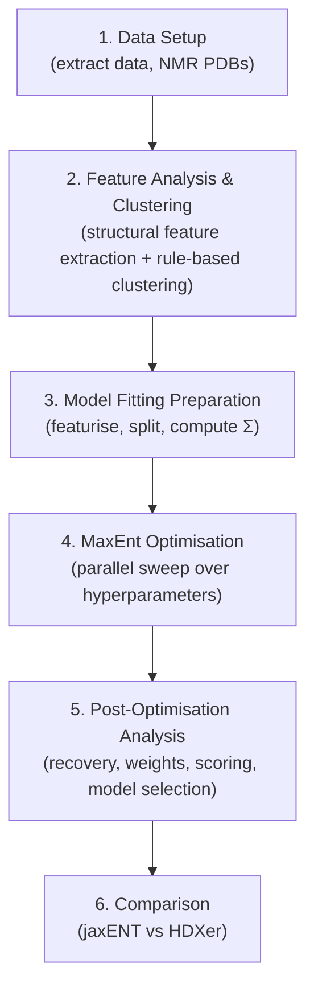

# Example 2: Cross-Validation with Real Experimental Data (MoPrP)

## Overview

The **CrossValidation** experiment applies the JAX-ENT maximum entropy (MaxEnt) reweighting framework to **real experimental HDX-MS data** for the first time. Unlike Example 1 (IsoValidation), which uses synthetic data with a known ground truth, this example validates the methodology against genuine experimental measurements of the Mouse Prion Protein (MoPrP), where the true conformational populations are independently characterised but not directly known from the HDX data itself.

### Biological System

This example uses the **Mouse Prion Protein (MoPrP)**, a system with multiple conformational states:
- **Folded** — Native structured conformation
- **PUF1** (Partially Unfolded Form 1) — State with local unfolding in the S1–H1 region
- **PUF2** (Partially Unfolded Form 2) — State with unfolding in the S2–H2–H3 region
- **Unfolded** — Fully disordered

The target state populations are derived from published ValDX (Validated Dynamics by HDX) experimental data and literature ratios.

### Scientific Motivation

While IsoValidation (Example 1) demonstrates that MaxEnt reweighting *can* recover known populations from synthetic data, the CrossValidation example tests whether it *does* work on real experimental data where:

1. **No ground truth exists in the HDX data itself** — the experimental uptake curves do not directly encode state populations.
2. **Independent validation is possible** — conformational states can be identified from MD structural features (not HDX), providing an orthogonal check.
3. **Model selection matters** — with real noise and model mismatch, it becomes critical to choose appropriate loss functions, convergence thresholds, and MaxEnt regularisation strengths.
4. **Cross-validation is essential** — train/validation splitting of peptides tests whether the fitted ensemble generalises beyond the training data.

### Ensembles

Two AlphaFold2-generated ensembles of MoPrP are used:

| Ensemble | Name | Description |
|----------|------|-------------|
| **AF2-MSAss** | `AF2_MSAss` | AlphaFold2 ensemble generated with MSA subsampling |
| **AF2-Filtered** | `AF2_filtered` | Filtered subset of the AF2 ensemble |

Both ensembles have been pre-clustered to reduce computational cost (stored as `all_clusters.xtc` in the data directories).

---

## Essential Workflow



---

## Prerequisites

### Installation

```bash
cd /path/to/installdir/
git clone https://github.com/alexisiddiqui/JAX-ENT.git
cd JAX-ENT/
uv venv
source .venv/bin/activate
uv pip install -e .
```

### Data Requirements

The following data must be available:

- **MoPrP tarball** (`data/_MoPrP.tar`) — Contains reference structures, ValDX experimental data, key residue definitions, and NMR PDB crops.
- **Pre-clustered trajectories** — `data/_cluster_MoPrP/` and `data/_cluster_MoPrP_filtered/` containing `all_clusters.xtc` files for the two AF2 ensembles.
- **AF2 reference topology** — `data/MoPrP_max_plddt_4334.pdb` (the highest pLDDT AF2 structure used as the reference).

> [!IMPORTANT]
> All scripts use **relative paths** calculated from `os.path.dirname(__file__)`. You should run all commands from the **JAX-ENT root directory**.

---

## Directory Structure

```
2_CrossValidation/
├── README.md                              # This file
├── INSTRUCTIONS.md                        # Quick-start instructions
├── commands.sh                            # Master command sequence
│
├── data/                                  # Data preparation & downloads
│   ├── _MoPrP.tar                         # Compressed MoPrP data archive
│   ├── _MoPrP/                            # Extracted: NMR PDBs, segments, dfrac, key_residues.json
│   ├── _cluster_MoPrP/                    # Pre-clustered AF2-MSAss trajectory
│   ├── _cluster_MoPrP_filtered/           # Pre-clustered AF2-Filtered trajectory
│   ├── MoPrP_max_plddt_4334.pdb           # AF2 reference structure
│   ├── extract_data_ValDX.py              # Extract & format ValDX experimental data
│   ├── get_NMR_PDBs.sh                    # Download NMR structures (2L39, 2L1H)
│   └── renumber_pdb.py                    # Renumber PDB residues to match analysis range
│
├── fitting/jaxENT/                        # Featurisation, splitting, & optimisation
│   ├── _featurise/                        # BV model features (.npz) & topologies (.json)
│   ├── _datasplits/                       # Train/val splits by strategy
│   ├── _optimise*/                        # Optimisation output directories
│   ├── featurise_CrossVal_MSAss_Filtered.py  # BV featurisation of both ensembles
│   ├── splitdata_CrossVal.py              # Data splitting (5 strategies × 3 replicates)
│   ├── optimise_ISO_TRI_BI_splits_maxENT.py  # MaxEnt optimisation sweep
│   ├── optimise_fn.py                     # Optimisation helper functions
│   ├── run_maxent_parallel.sh             # Production parallel runner
│   └── run_maxent_parallel_test.sh        # Test parallel runner + full analysis pipeline
│
├── analysis/                              # Post-optimisation analysis
│   ├── calculate_state_ratios.py          # Compute target state ratios from literature
│   ├── analyse_LocalFeatures_PUFs.py      # Extract structural features from trajectories
│   ├── cluster_LocalFeatures_PUF.py       # PCA + rule-based clustering of features
│   ├── compute_recovery%_PUF.py           # Compute unweighted recovery percentages
│   ├── analyse_split_CrossVal.py          # Visualise train/val data splits
│   ├── recovery_analysis_ISO_TRI_BI_precluster.py  # JSD-based conformational recovery
│   ├── weights_validation_ISO_TRI_BI_precluster.py # Frame weight validation (KL, ESS)
│   ├── analyse_loss_ISO_TRI_BI.py         # Loss landscape & convergence analysis
│   ├── process_optimisation_results.py    # Extract predictions from HDF5 results
│   ├── score_models_ISO_TRI_BI.py         # Compute MSE, dMSE, work metrics, recovery %
│   ├── analyse_scores_mixed_linear_model.py  # Statistical model selection analysis
│   ├── plot_selected_models_ISO_TRI_BI.py # Plot selected model comparisons
│   ├── plot_compare_jaxENT_HDXer.py       # jaxENT vs HDXer comparison
│   ├── feature_spec.MD                    # Feature specification documentation
│   ├── rules_spec.MD                      # Clustering rules documentation
│   ├── MoPrP_unfolding_spec.json          # Structural feature definitions
│   └── MoPrP_rules_spec.json             # Rule-based clustering thresholds
│
└── archive/                               # Archived/deprecated scripts
```

---

## Step-by-Step Workflow

### Step 1: Data Setup & Extraction

#### 1a. Extract MoPrP Data Archive

```bash
tar -xvf jaxent/examples/2_CrossValidation/data/_MoPrP.tar \
    -C jaxent/examples/2_CrossValidation/data/
```

Extracts the MoPrP data including NMR PDB crops, reference structures, HDX segments, deuterium fraction files, and key residue definitions (`key_residues.json`).

#### 1b. Extract ValDX Experimental Data

**Script**: [extract_data_ValDX.py](data/extract_data_ValDX.py)

```bash
python jaxent/examples/2_CrossValidation/data/extract_data_ValDX.py
```

Extracts and formats the ValDX (Validated Dynamics by HDX) experimental data into the standard JAX-ENT format:
- **Deuterium fraction file** (`MoPrP_dfrac.dat`) with measured HDX uptake values across timepoints.
- **Segments file** (`MoPrP_segments.txt`) with peptide start/end residue indices.

#### 1c. Calculate State Ratios

**Script**: [calculate_state_ratios.py](analysis/calculate_state_ratios.py)

```bash
python jaxent/examples/2_CrossValidation/analysis/calculate_state_ratios.py
```

Computes target conformational state ratios from published literature data. Produces `state_ratios.json` containing fractional populations for Folded, PUF1, PUF2, and Unfolded states.

---

### Step 2: PDB Preparation

#### 2a. Download NMR Reference Structures

```bash
bash jaxent/examples/2_CrossValidation/data/get_NMR_PDBs.sh
```

Downloads NMR structures of MoPrP from the PDB:
- **2L39** — MoPrP at 37°C (partially unfolded)
- **2L1H** — MoPrP at 20°C (folded)

These serve as experimental reference conformations for feature analysis and clustering.

#### 2b. Renumber PDB Residues

**Script**: [renumber_pdb.py](data/renumber_pdb.py)

```bash
# Renumber 2L39 (residues 119-231 → 1-113)
python jaxent/examples/2_CrossValidation/data/renumber_pdb.py \
    --input_pdb data/_MoPrP/2L39.pdb \
    --output_pdb data/_MoPrP/2L39_renum.pdb \
    --selection "resid 119-231" --resi_start 1

# Renumber 2L1H
python jaxent/examples/2_CrossValidation/data/renumber_pdb.py \
    --input_pdb data/_MoPrP/2L1H.pdb \
    --output_pdb data/_MoPrP/2L1H_renum.pdb \
    --selection "resid 119-231" --resi_start 1
```

Renumbers residues from the original PDB numbering (119–231) to 1-indexed, matching the analysis range used throughout the pipeline.

---

### Step 3: Feature Analysis & Clustering

This step characterises the conformational states in the MD ensembles using structural features, independently of HDX data.

#### 3a. Extract Structural Features

**Script**: [analyse_LocalFeatures_PUFs.py](analysis/analyse_LocalFeatures_PUFs.py)

```bash
python jaxent/examples/2_CrossValidation/analysis/analyse_LocalFeatures_PUFs.py \
    --ensembles "data/MoPrP_max_plddt_4334.pdb,data/_cluster_MoPrP_filtered/clusters/all_clusters.xtc" \
                "data/MoPrP_max_plddt_4334.pdb,data/_cluster_MoPrP/clusters/all_clusters.xtc" \
                "data/_MoPrP/2L1H_crop.pdb,data/_MoPrP/2L1H_crop.pdb" \
                "data/_MoPrP/2L39_crop.pdb,data/_MoPrP/2L39_crop.pdb" \
    --names "AF2-Filtered" "AF2-MSAss" "NMR-20C" "NMR-37C" \
    --json_data_path data/_MoPrP/key_residues.json \
    --output_dir analysis/_MoPrP_analysis_clusters_feature_spec_AF2 \
    --json_feature_spec analysis/MoPrP_unfolding_spec.json \
    --reference_pdb data/MoPrP_max_plddt_4334.pdb \
    --save_pdbs
```

Calculates per-frame structural features for four ensembles (AF2-Filtered, AF2-MSAss, NMR-20°C, NMR-37°C):
- **RMSD** to the AF2 reference structure
- **Radius of Gyration** (overall and per-region)
- **SASA** (Solvent Accessible Surface Area)
- **Native contacts** (fraction retained from reference)
- **Secondary structure** content (DSSP-based)
- **Dihedral angles** (φ/ψ changes for key regions defined in `MoPrP_unfolding_spec.json`)

Features are configured via [`MoPrP_unfolding_spec.json`](analysis/MoPrP_unfolding_spec.json) which defines structural regions like `S1-H1` and `S2-H2-H3`.

**Output**: `.npy` feature arrays in `analysis/_MoPrP_analysis_clusters_feature_spec_AF2/data/`.

#### 3b. Apply Rule-Based Clustering

**Script**: [cluster_LocalFeatures_PUF.py](analysis/cluster_LocalFeatures_PUF.py)

```bash
python jaxent/examples/2_CrossValidation/analysis/cluster_LocalFeatures_PUF.py \
    --ensembles "data/MoPrP_max_plddt_4334.pdb,data/_cluster_MoPrP_filtered/clusters/all_clusters.xtc" \
                "data/MoPrP_max_plddt_4334.pdb,data/_cluster_MoPrP/clusters/all_clusters.xtc" \
                "data/_MoPrP/2L1H_crop.pdb,data/_MoPrP/2L1H_crop.pdb" \
                "data/_MoPrP/2L39_crop.pdb,data/_MoPrP/2L39_crop.pdb" \
    --names "AF2-Filtered" "AF2-MSAss" "NMR-20C" "NMR-37C" \
    --json_data_path data/_MoPrP/key_residues.json \
    --input_dir analysis/_MoPrP_analysis_clusters_feature_spec_AF2 \
    --output_dir analysis/_MoPrP_analysis_clusters_feature_spec_AF2_test \
    --json_feature_spec analysis/MoPrP_unfolding_spec.json \
    --json_rules_spec analysis/MoPrP_rules_spec.json \
    --save_pdbs
```

Applies rule-based clustering using thresholds defined in [`MoPrP_rules_spec.json`](analysis/MoPrP_rules_spec.json). Frames are classified into conformational states (Folded, PUF1, PUF2, Unfolded) based on structural feature values rather than unsupervised clustering.

**Output**: Per-ensemble CSV files with cluster assignments (`*_frame_to_cluster.csv`) in `clusters/` subdirectory.

#### 3c. Compute Unweighted Recovery

**Script**: [compute_recovery%_PUF.py](analysis/compute_recovery%_PUF.py)

```bash
python jaxent/examples/2_CrossValidation/analysis/compute_recovery%_PUF.py
```

Computes baseline (uniform-weight) recovery percentages using Jensen-Shannon Divergence (JSD) between the unweighted cluster populations and target state ratios. This establishes the "prior" recovery before any optimisation.

---

### Step 4: Model Fitting Preparation

#### 4a. Featurise Ensembles

**Script**: [featurise_CrossVal_MSAss_Filtered.py](fitting/jaxENT/featurise_CrossVal_MSAss_Filtered.py)

```bash
python jaxent/examples/2_CrossValidation/fitting/jaxENT/featurise_CrossVal_MSAss_Filtered.py
```

Featurises both AF2 ensembles using the **Best-Vendruscolo (BV) model** with hard contacts:
1. Loads trajectories via `Experiment_Builder`.
2. Runs `run_featurise()` to compute **heavy atom contacts** and **H-bond acceptor contacts** per residue per frame.
3. Calculates intrinsic exchange rates.
4. Saves features (`.npz`) and topology (`.json`) to `_featurise/`.

**Output**: `_featurise/features_AF2_MSAss.npz`, `_featurise/features_AF2_filtered.npz`, and corresponding topology JSON files.

#### 4b. Split Data into Training/Validation Sets

**Script**: [splitdata_CrossVal.py](fitting/jaxENT/splitdata_CrossVal.py)

```bash
python jaxent/examples/2_CrossValidation/fitting/jaxENT/splitdata_CrossVal.py
```

Splits the experimental HDX peptide data into training and validation sets using **multiple splitting strategies** with **three replicates** each:

| Strategy | Description |
|----------|-------------|
| `random` | Random peptide assignment |
| `sequence` | Contiguous sequence-based blocks |
| `sequence_cluster` | Non-redundant sequence clustering |
| `stratified` | Stratified sampling by deuteration fraction |
| `spatial` | 3D spatial clustering using Cα atom positions |

Each split is saved as separate topology JSON and dfrac CSV files in `_datasplits/<strategy>/split_XXX/`.

#### 4c. Analyse Splits

**Script**: [analyse_split_CrossVal.py](analysis/analyse_split_CrossVal.py)

```bash
python jaxent/examples/2_CrossValidation/analysis/analyse_split_CrossVal.py
```

Visualises the data splits with train/validation peptide distribution heatmaps.

#### 4d. Compute Sigma (Covariance) Matrices

```bash
python jaxent/examples/1_IsoValidation_OMass/fitting/jaxENT/compute_sigma_real.py \
    --dfrac_file jaxent/examples/2_CrossValidation/data/_MoPrP/_output/MoPrP_dfrac.dat \
    --segs_file  jaxent/examples/2_CrossValidation/data/_MoPrP/_output/MoPrP_segments.txt \
    --output_dir jaxent/examples/2_CrossValidation/data/_MoPrP_covariance_matrices/
```

> [!NOTE]
> This step uses the `compute_sigma_real.py` script from **Example 1**. It computes covariance matrices from the real experimental data (rather than cluster-weighted synthetic data as in Example 1), producing the Σ and Σ⁻¹ matrices needed for the `Sigma_MSE` loss function.

---

### Step 5: MaxEnt Optimisation

**Script**: [run_maxent_parallel_test.sh](fitting/jaxENT/run_maxent_parallel_test.sh)

```bash
bash jaxent/examples/2_CrossValidation/fitting/jaxENT/run_maxent_parallel_test.sh
```

This master script runs the full optimisation **and** post-optimisation analysis pipeline.

#### 5a. Optimisation Sweep

Calls [`optimise_ISO_TRI_BI_splits_maxENT.py`](fitting/jaxENT/optimise_ISO_TRI_BI_splits_maxENT.py) in parallel across all combinations of:

| Parameter | Default Values |
|-----------|----------------|
| **Ensembles** | `AF2_filtered`, `AF2_MSAss` |
| **Loss functions** | `mcMSE`, `MSE`, `Sigma_MSE` |
| **Split types** | `sequence_cluster`, `spatial` (configurable) |
| **MaxEnt scaling** | 1, 5, 10, 50, 100, 500, 1000 |
| **Convergence rates** | 1e-1 → 1e-8 (logarithmic sweep) |

Each optimisation:
1. Loads features and split data.
2. Initialises a `Simulation` with the BV forward model.
3. Optimises frame weights using `OptaxOptimizer` with MaxEnt regularisation (KL divergence from uniform prior).
4. Saves `OptimizationHistory` as HDF5 files.

**Loss functions explained**:
- **MSE**: Standard mean squared error between predicted and experimental uptake.
- **mcMSE**: Mean-centred MSE, removing global offset effects.
- **Sigma_MSE**: MSE weighted by the inverse covariance matrix (Σ⁻¹), accounting for inter-residue correlations.

#### 5b. Automated Post-Optimisation Analysis Pipeline

After all optimisations complete, the script sequentially runs:

1. **Recovery Analysis** ([`recovery_analysis_ISO_TRI_BI_precluster.py`](analysis/recovery_analysis_ISO_TRI_BI_precluster.py)) — Computes JSD-based conformational state recovery, producing heatmaps and volcano plots.
2. **Weights Validation** ([`weights_validation_ISO_TRI_BI_precluster.py`](analysis/weights_validation_ISO_TRI_BI_precluster.py)) — Analyses frame weight distributions: KL divergence, ESS, and cross-split consistency.
3. **Loss Analysis** ([`analyse_loss_ISO_TRI_BI.py`](analysis/analyse_loss_ISO_TRI_BI.py)) — Convergence-vs-MaxEnt heatmaps, model scoring (AIC/BIC), and best model selection.
4. **Result Processing** ([`process_optimisation_results.py`](analysis/process_optimisation_results.py)) — Extracts predictions (lnPF, uptake), KL divergences, frame weights, and cluster ratios from HDF5 files into `.npy`/`.csv` format.
5. **Model Scoring** ([`score_models_ISO_TRI_BI.py`](analysis/score_models_ISO_TRI_BI.py)) — Computes comprehensive score metrics (MSE, dMSE, work metrics, recovery %) for all processed runs.
6. **Statistical Analysis** ([`analyse_scores_mixed_linear_model.py`](analysis/analyse_scores_mixed_linear_model.py)) — Mixed linear effects modelling for model selection: regression, stability, and partial R² analysis.
7. **Visualisation** ([`plot_selected_models_ISO_TRI_BI.py`](analysis/plot_selected_models_ISO_TRI_BI.py)) — Publication-ready plots comparing model selection performance before and after convergence filtering.

---

### Step 6: Comparison with HDXer

**Script**: [plot_compare_jaxENT_HDXer.py](analysis/plot_compare_jaxENT_HDXer.py)

```bash
python jaxent/examples/2_CrossValidation/analysis/plot_compare_jaxENT_HDXer.py
```

Creates publication-ready comparison plots between jaxENT and HDXer results, panelled by experiment and ensemble.

---

## Key Metrics

### Recovery Percentage

The primary metric for CrossValidation success. Computed as:

```
Recovery = 100 × (1 - √JSD(P_target ∥ P_fit))
```

Where:
- **JSD** is the Jensen-Shannon Divergence (base 2, bounded in [0, 1]).
- **P_target** is the target state distribution from `state_ratios.json` (Folded, PUF1, PUF2, Unfolded).
- **P_fit** is the fitted state population derived from optimised frame weights mapped to cluster assignments.

### KL Divergence

Measures how far the optimised frame weight distribution has moved from the uniform prior:

```
KL(P_weights ∥ U_uniform)
```

Higher values indicate more aggressive reweighting. The MaxEnt regularisation penalises this divergence.

### Effective Sample Size (ESS)

Quantifies how many "effective" frames remain after reweighting:

```
ESS = (Σ wᵢ)² / Σ wᵢ²
```

Low ESS indicates that a few frames dominate the ensemble, suggesting potential overfitting.

### Work Metrics

Thermodynamic work metrics derived from log-protection factors, quantifying the "cost" of fitting:

| Metric | Description |
|--------|-------------|
| **Work Scale** (δH_abs) | Shift in global magnitude of protection factors |
| **Work Shape** (δH_opt) | Energetic cost of changing the relative PF profile |
| **Work Density** (-TδS_opt) | Entropic cost of PF redistribution |
| **Work Fitting** (δG_opt) | Total optimisation work done |

### dMSE (Delta MSE)

Change in MSE relative to the prior (uniform-weight) model:

```
dMSE = MSE_posterior - MSE_prior
```

Negative values indicate the fit improved over the prior. Computed separately for train, validation, and test sets.

---

## Methodological Details

### Conformational State Assignment

Unlike Example 1 (which uses simple RMSD-based clustering), MoPrP states are defined by **rule-based clustering** on structural features:

1. **Structural features** are computed per frame: region-specific RMSD, radius of gyration, native contacts, secondary structure content, and dihedral angles.
2. **Rules** defined in `MoPrP_rules_spec.json` specify threshold conditions on these features.
3. Frames meeting specific conditions are assigned states (Folded, PUF1, PUF2, Unfolded).

This approach uses domain knowledge about which structural features distinguish the partially unfolded forms, rather than relying solely on geometric clustering.

### Key Structural Regions

Defined in `MoPrP_unfolding_spec.json` and `key_residues.json`:

| Region | Description |
|--------|-------------|
| **S1-H1** | β-sheet 1 and Helix 1 region (associated with PUF1) |
| **S2-H2-H3** | β-sheet 2, Helix 2, and Helix 3 region (associated with PUF2) |

### Model Selection Methodology

The analysis pipeline implements a systematic model selection framework:

1. **Multi-metric scoring**: Each optimisation run is scored on MSE (train/val/test), dMSE, work metrics, KL divergence, and recovery %.
2. **Convergence filtering**: Models can be filtered to retain only the best-performing convergence threshold (based on validation loss) per hyperparameter combination.
3. **Mixed-effects modelling**: Linear effects models quantify the predictive utility of each metric, with random effects for grouping variables (split type, ensemble).
4. **Stability analysis**: Variance decomposition (ANOVA, η², F-tests) assesses metric robustness across split types and ensembles.

---

## Configuration Reference

### Data Splitting Parameters

| Parameter | Value |
|-----------|-------|
| Training fraction | 0.5 |
| Number of replicates | 3 |
| Peptide trim | 1 residue |
| Overlap removal | Yes |
| Split strategies | random, sequence, sequence_cluster, stratified, spatial |

### Optimisation Parameters

| Parameter | Default | Description |
|-----------|---------|-------------|
| Optimiser | Adam (via optax) | Gradient-based optimiser |
| Learning rate | 1.0 | Adam learning rate |
| EMA alpha | 0.5 | Exponential moving average smoothing |
| Forward model scaling | 1000.0 | Scaling factor for forward model output |
| Convergence sweep | 1e-1 → 1e-8 | Logarithmic convergence threshold sweep |
| MaxEnt scaling values | {1, 5, 10, 50, 100, 500, 1000} | MaxEnt regularisation strengths |
| Parallel jobs | 20 | Maximum concurrent optimisation processes |
| Platform | CPU | Forced via `JAX_PLATFORM_NAME=cpu` |

### Shell Script CLI Arguments

The `run_maxent_parallel_test.sh` script accepts:

| Flag | Description |
|------|-------------|
| `--ensembles` | Comma-separated ensemble names |
| `--losses` | Comma-separated loss function names |
| `--split-types` | Comma-separated split strategies |
| `--maxent-values` | Comma-separated MaxEnt scaling values |
| `--n-steps` | Optimisation steps per convergence stage |
| `--learning-rate` | Adam learning rate |
| `--ema-alpha` | EMA smoothing factor |
| `--forward-model-scaling` | Forward model output scaling |
| `--dir-name` | Output directory name prefix |
| `-j`/`--jobs` | Maximum parallel processes |

---

## Differences from Example 1 (IsoValidation)

| Aspect | Example 1 (IsoValidation) | Example 2 (CrossValidation) |
|--------|---------------------------|----------------------------|
| **Data source** | Synthetic (computed from known populations) | Real experimental HDX-MS |
| **Ground truth** | Known exactly (Open:Closed = 40:60) | Independent estimation from structural analysis |
| **Protein system** | TeaA membrane transporter | Mouse Prion Protein (MoPrP) |
| **Conformational states** | 2 (Open, Closed) | 4 (Folded, PUF1, PUF2, Unfolded) |
| **State assignment** | RMSD-based (hard cutoff) | Rule-based on multiple structural features |
| **Ensembles** | ISO_TRI, ISO_BI (from MD) | AF2_MSAss, AF2_filtered (from AlphaFold2) |
| **Sigma computation** | Cluster-weighted synthetic | Real experimental data |
| **Validation** | Direct recovery comparison | Cross-validation + independent structural check |

---

## References

- **Mouse Prion Protein** — PDB: 2L39 (37°C), 2L1H (20°C). NMR structures of MoPrP under different conditions.
- **ValDX** — Validated Dynamics by HDX. Published experimental data used as ground truth for state population estimates.
- **Best & Vendruscolo** — Structure-based prediction of HDX protection factors. The BV model used for featurisation.
- **JAX-ENT manuscript** — See `output_omc.pdf` in the repository root for the full paper describing the CrossValidation methodology and results.
